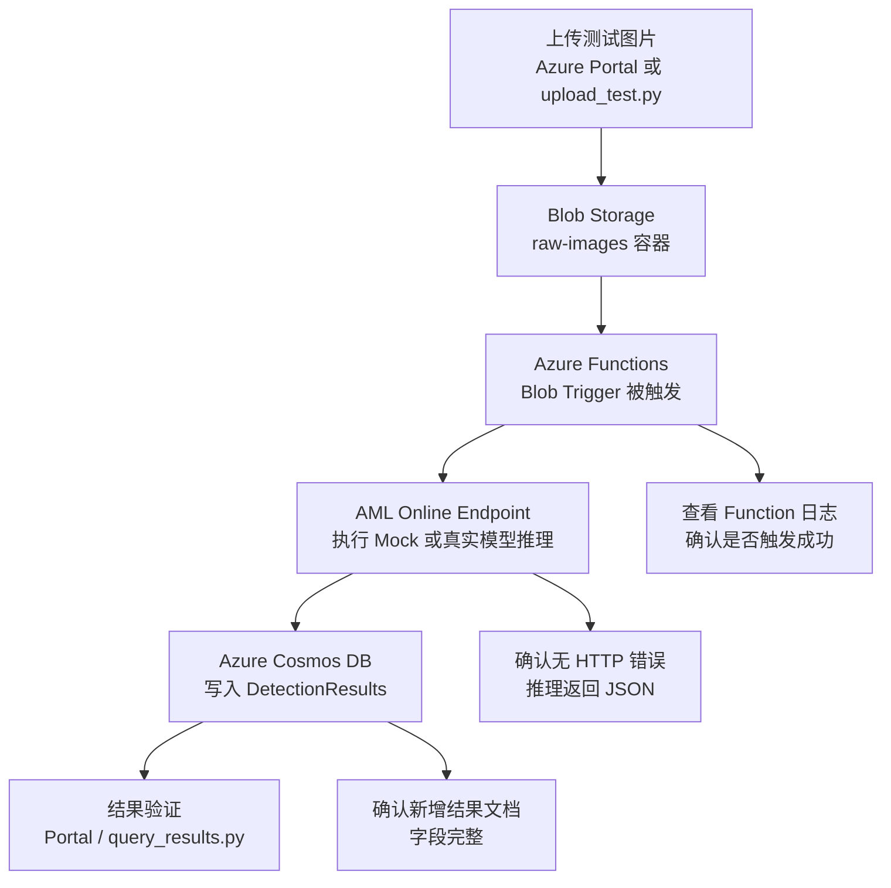

# MVP 快速验证指南

> **Minimum Viable Product — 货架视觉检测 Azure PoC（自有模型版）**  
> 目标：用最少的资源跑通「上传图片 → AML 自有模型推理 → 结果入库」完整链路

---

## 1. MVP 范围

### 保留（核心链路）

```
本地/手动上传图片
        ↓
   Azure Blob Storage [shelfmvpstore001] / [raw-images]
        ↓
   Azure Functions [shelf-mvp-fn-b1]（Blob Trigger）
        ↓
    AML Online Endpoint [shelf-detection-endpoint]（默认 Mock，可切换真实模型适配器）
        ↓
   Azure Cosmos DB [shelf-mvp-cosmos] / [ShelfVisionDB] / [DetectionResults]（Serverless）
        ↓
   Python 脚本查询结果
```

### 移除（降低复杂度）

| 完整方案组件 | MVP 替代方案 | 原因 |
|------------|------------|------|
| Azure IoT Hub | 手动/脚本上传图片到 Blob | 无需真实设备 |
| Azure Event Grid | Blob Trigger 直连 | PoC 延迟可接受 |
| Azure OpenAI | 不使用，直接调 AML 端点 | 验证自有模型接入流程 |
| GPU 实例 | CPU 实例（Standard_DS2_v2） | MVP 阶段 score.py 无需 GPU |
| Azure API Management | 直接查询 Cosmos DB | 无需对外暴露接口 |
| Power BI | Python 脚本打印结果 | 无需可视化配置 |

### 预计成本

> 轻度测试（每天约 100 张图片）。AML Endpoint 按运行时长计费，**测试结束后及时删除 Deployment 可大幅降低成本**。

| 服务 | 规格 | 月估算 |
|------|------|--------|
| Blob Storage | 热层 1 GB | < $0.1 |
| Azure Functions | 消费计划，免费额度内 | $0 |
| Azure Machine Learning | Standard_DS2_v2 CPU × 1（常开） | ~$100 |
| Cosmos DB | Serverless，低 RU | < $1 |
| **合计** | | **~$100/月（按需开关端点可降至 <$10）** |

---

## 2. 前置准备

- Azure 订阅（免费试用账户即可）
- Python 3.10+（本地运行上传/查询脚本）
- Azure CLI（可选，用于命令行创建资源）
- Azure Functions Core Tools（本地调试 Function 用，可选）

安装依赖：

```bash
# 本地运行上传/查询脚本 + AML 部署脚本
pip install azure-storage-blob azure-cosmos azure-ai-ml azure-identity
```

---

## 3. 创建 Azure 资源（约 15 分钟）

### 3.1 创建资源组

在 [portal.azure.com](https://portal.azure.com) 中：

```
+ 创建资源 → 资源组
    名称：[rg-aml-test]
    区域：[westus2]（或离你最近的区域）
```

### 3.2 创建 Storage Account

```
+ 创建资源 → 存储账户
    资源组：[rg-aml-test]
    名称：[shelfmvpstore001]（全局唯一）
  冗余：LRS（本地冗余，成本最低）
```

创建完成后，进入存储账户 → **容器** → 新建：
- *[raw-images]*（存放待检测图片）
- *[results]*（可选）

### 3.3 创建 AML 工作区并部署模拟推理端点

#### 步骤一：在 Portal 创建 AML Workspace

```
+ 创建资源 → 搜索"Azure Machine Learning"
    资源组：[rg-aml-test]
    工作区名称：[amltestworkspace]
    区域：[westus2]（与其他资源同区域）
```

创建完成后记录：
- **订阅 ID**（概述页面）
- **资源组名称**：*[rg-aml-test]*
- **工作区名称**：*[amltestworkspace]*

官方参考链接：
- Workspace 创建入口：<https://learn.microsoft.com/azure/machine-learning/quickstart-create-resources?view=azureml-api-2>
- Workspace 管理说明：<https://learn.microsoft.com/azure/machine-learning/how-to-manage-workspace?view=azureml-api-2>

#### 步骤二：准备模型目录（默认 Mock，可扩展到真实模型）

在本地创建目录 `mock_model/`，建议包含以下文件：

> 这里的 `mock_model/`、`score.py`、`model_placeholder.txt` 等，都是先在你电脑本地这个项目目录里创建的文件，不是先去 AML Workspace 里手工新建文件。
>
> 当前仓库的实际部署方式是：先在本地准备这些文件，再由本地脚本把它们注册/上传到 Azure Machine Learning。也就是说：
> - **本地**：准备模型目录、推理脚本、依赖文件
> - **云上 AML**：保存注册后的 Model / Environment / Endpoint / Deployment

**`mock_model/model_placeholder.txt`**（默认占位文件；没有真实模型文件时走 Mock）

```
shelf-detection-model-v1-placeholder
```

**`mock_model/score.py`**（统一推理入口）

- 默认行为：回退到 Mock 结果，确保 MVP 一定可跑通
- 可选行为：如果 `real_model_adapter.py` 已实现并能成功加载，就切到真实模型逻辑

**`mock_model/real_model_adapter.py`**（真实模型适配器模板）

- 在这里加载 `.pt`、`.onnx` 或其他模型文件
- 输入保持和当前 Function 一致：`blob_name`、`image_b64`
- 输出保持和当前 Mock 结果一致：`description`、`compliance_score`、`issues`、`out_of_stock_positions`、`objects`

**`mock_model/model_artifacts/`**（可选）

- 放置真实模型文件，例如 `model.onnx`、`model.pt`
- `deploy_to_aml.py` 会优先注册这个目录；若目录里没有真实模型文件，则自动回退到 `model_placeholder.txt`

`score.py` 示例：

```python
import json
import os

_adapter = None
_mode = "mock"

def init():
    global _adapter, _mode

    if os.getenv("MODEL_RUNTIME_MODE", "auto").lower() == "mock":
        print("模型初始化完成（Mock）")
        return

    try:
        import real_model_adapter as adapter
        adapter.init_model()
        _adapter = adapter
        _mode = "real"
        print("模型初始化完成（Real Adapter）")
    except Exception as exc:
        print(f"真实模型未启用，回退到 Mock: {exc}")

def run(raw_data):
    payload = json.loads(raw_data) if isinstance(raw_data, str) else raw_data
    input_data = payload.get("input_data", payload)

    if _mode == "real" and _adapter is not None:
        result = _adapter.predict(input_data)
    else:
        result = {
            "description": "货架图像分析完成（模拟结果）",
            "compliance_score": 0.82,
            "issues": [],
            "out_of_stock_positions": [],
            "objects": []
        }

    return json.dumps(result)
```

**`mock_model/conda.yml`**（推理环境依赖）

```yaml
channels:
  - conda-forge
dependencies:
  - python=3.10
  - pip:
    - azureml-inference-server-http   # AML 推理服务器（必须）
        - numpy
        - pillow
```

如果真实模型需要额外依赖，例如 `torch`、`onnxruntime-gpu`、`opencv-python-headless`，再按模型框架补充进去。

#### 步骤二补充说明：这些文件最终如何进 AML？

当前这套 MVP 不是把 `mock_model/` 手工复制到某台 AML 虚机上运行，而是通过 **AML Online Endpoint 部署** 的方式把本地内容提交到云端：

1. 本地 `deploy_to_aml.py` 读取 `./mock_model` 下的文件
2. 脚本调用 Azure ML SDK，向工作区注册 **Model** 和 **Environment**
3. 脚本把 `mock_model/score.py` 作为在线推理入口脚本上传为 **Code Configuration**
4. 脚本创建 **Managed Online Endpoint** 和 **blue Deployment**
5. AML 在云上拉起推理容器，对外暴露 HTTPS 推理地址

所以你可以把它理解成：

- `mock_model/` 是本地源码和模型资产目录
- `deploy_to_aml.py` 是“打包并发布到 AML”的脚本
- 真正对外提供推理服务的是 AML Online Endpoint，不是你本地电脑

#### 步骤三：注册模型并部署端点

在本地运行 `deploy_to_aml.py`：

```python
# deploy_to_aml.py
from azure.ai.ml import MLClient
from azure.ai.ml.entities import (
    Model, Environment,
    ManagedOnlineEndpoint, ManagedOnlineDeployment, CodeConfiguration
)
from azure.identity import DefaultAzureCredential

ml_client = MLClient(
    DefaultAzureCredential(),
    subscription_id="<YOUR_SUBSCRIPTION_ID>",
    resource_group_name="[rg-aml-test]",
    workspace_name="[amltestworkspace]"
)

# 1. 注册模型
#    - mock_model/model_artifacts/ 下有真实模型文件时，注册整个目录
#    - 否则回退到 model_placeholder.txt
model = ml_client.models.create_or_update(
    Model(
        path="<自动选择 model_artifacts/ 或 model_placeholder.txt>",
        name="[shelf-detection-model]",
        version="1",
        description="货架检测模型（Mock/Real 双模式）"
    )
)

# 2. 注册推理环境
env = ml_client.environments.create_or_update(
    Environment(
        name="[shelf-detection-env]",
        conda_file="./mock_model/conda.yml",
        image="mcr.microsoft.com/azureml/openmpi4.1.0-ubuntu20.04",
    )
)

# 3. 创建 Online Endpoint
endpoint = ml_client.online_endpoints.begin_create_or_update(
    ManagedOnlineEndpoint(
        name="[shelf-detection-endpoint]",
        auth_mode="key"
    )
).result()
print(f"Endpoint 已创建：{endpoint.name}")

# 4. 创建 Deployment（CPU 实例，默认先跑 Mock；接好真实模型后无需改调用链）
deployment = ml_client.online_deployments.begin_create_or_update(
    ManagedOnlineDeployment(
        name="[blue]",
        endpoint_name="[shelf-detection-endpoint]",
        model=model,
        environment=env,
        code_configuration=CodeConfiguration(
            code="./mock_model",
            scoring_script="score.py"
        ),
        instance_type="Standard_DS2_v2",   # CPU 实例，成本最低
        instance_count=1
    )
).result()

# 5. 将 100% 流量切到 [blue]
endpoint.traffic = {"[blue]": 100}
ml_client.online_endpoints.begin_create_or_update(endpoint).result()

# 获取调用信息
endpoint = ml_client.online_endpoints.get("[shelf-detection-endpoint]")
keys = ml_client.online_endpoints.get_keys("[shelf-detection-endpoint]")
print(f"\n端点 URL：{endpoint.scoring_uri}")
print(f"API Key：{keys.primary_key}")
```

```bash
python deploy_to_aml.py
```

> **核验结论**：按当前仓库内容看，AML 部署主路径确实是 **本地脚本 / 命令行方式**，不是纯 Portal 点选完成。
>
> 依据：
> - `deploy_to_aml.py` 会在本地调用 `azure.ai.ml` SDK
> - 脚本里明确执行了注册 Model、注册 Environment、创建 Endpoint、创建 Deployment、切流量等动作
> - 也就是说，文档当前默认读者是在本地终端运行部署，而不是在 Portal 里一步一步点出来

官方参考链接：
- Online Endpoint 部署说明：<https://learn.microsoft.com/azure/machine-learning/how-to-deploy-online-endpoints?view=azureml-api-2>
- Deploy a model as an online endpoint：<https://learn.microsoft.com/en-us/azure/machine-learning/tutorial-deploy-model?view=azureml-api-2>

记录输出的：
- **端点 URL**：*[https://[shelf-detection-endpoint].[westus2].inference.ml.azure.com/score]*
- **API Key**：primary_key 的值

#### 步骤四：如果想尽量通过 Portal / Studio 操作，可以这样做

这里需要区分两个界面：

- **Azure Portal**：适合创建 AML Workspace 资源本身
- **Azure Machine Learning Studio**：适合做模型注册、环境配置、在线端点部署

也就是说，创建 Workspace 主要在 Portal；部署模型端点，更常见的是从 Portal 进入 AML Studio 后操作。

**4.1 从 Portal 进入 AML Studio**

```text
Azure Portal → Azure Machine Learning → 进入工作区 [amltestworkspace] → Launch studio
```

**4.2 在 Studio 注册模型**

```text
AML Studio → Assets → Models → Register → From local files
```

建议选择其一：

- 仅跑 Mock：上传 `mock_model/model_placeholder.txt`
- 准备真实模型：上传 `mock_model/model_artifacts/` 下真实模型目录

模型名称可填写：*[shelf-detection-model]*

**4.3 在 Studio 创建推理环境**

```text
AML Studio → Assets → Environments → Create
```

推荐配置：

- Environment name：*[shelf-detection-env]*
- Base image：`mcr.microsoft.com/azureml/openmpi4.1.0-ubuntu20.04`
- Conda file：上传或粘贴 `mock_model/conda.yml` 内容

**4.4 在 Studio 创建 Online Endpoint**

```text
AML Studio → Endpoints → Online endpoints → Create
```

推荐配置：

- Endpoint type：Managed online endpoint
- Endpoint name：*[shelf-detection-endpoint]*
- Authentication：Key

**4.5 在 Endpoint 下创建 Deployment**

```text
进入 [shelf-detection-endpoint] → Deployments → Create / New deployment
```

推荐配置：

- Deployment name：*[blue]*
- Model：选择 *[shelf-detection-model]*
- Environment：选择 *[shelf-detection-env]*
- Code path：上传本地 `mock_model/`
- Scoring script：`score.py`
- Instance type：`Standard_DS2_v2`
- Instance count：`1`

如果只跑 Mock，可在 Deployment 的 Environment variables 中加入：

- `MODEL_RUNTIME_MODE=mock`

**4.6 配置流量并获取调用信息**

```text
进入 Endpoint → Traffic → 将 100% 流量指向 [blue]
进入 Endpoint → Consume → 复制 REST endpoint 和 Primary key
```

然后把这两个值配置到 Function App：

- `AML_ENDPOINT_URL`
- `AML_API_KEY`

> **保留 Mock 的同时接真实模型**：
> 1. 将真实模型文件放入 `mock_model/model_artifacts/`
> 2. 在 `mock_model/real_model_adapter.py` 中实现 `init_model()` 和 `predict()`
> 3. 按需在 `conda.yml` 中补充框架依赖
> 4. 重新部署 AML deployment
>
> 如果适配器未完成或加载失败，`score.py` 会自动回退到 Mock 模式，不影响 MVP 联调。

### 3.4 创建 Cosmos DB

```
+ 创建资源 → Azure Cosmos DB → NoSQL API
    资源组：[rg-aml-test]
    账户名：[shelf-mvp-cosmos]
  容量模式：Serverless（按量计费，最省钱）
```

创建完成后：
1. 进入数据资源管理器 → 新建数据库：*[ShelfVisionDB]*
2. 新建容器：
    - 容器 ID：*[DetectionResults]*
   - 分区键：`/storeId`

记录：
- **URI**：在「概述」页面获取
- **主密钥**：在「密钥」页面获取

### 3.5 创建 Function App

```
+ 创建资源 → 函数应用
    资源组：[rg-aml-test]
    名称：[shelf-mvp-fn-b1]（全局唯一）
  运行时堆栈：Python 3.11
  托管计划：消费量（Serverless）
    存储账户：选择 [shelfmvpstore001]
```

---

## 4. 部署 Azure Function

### 4.1 Function 代码

在本地新建文件夹 `shelf_func/`，创建以下文件：

**`function_app.py`**

```python
import azure.functions as func
import logging
import json
import os
import base64
import requests
from datetime import datetime, timezone
from azure.cosmos import CosmosClient

app = func.FunctionApp()

# 从环境变量读取配置（在 Function App → 配置 中设置）
AML_ENDPOINT_URL = os.environ["AML_ENDPOINT_URL"]   # AML 推理端点 URL
AML_API_KEY      = os.environ["AML_API_KEY"]         # AML 端点 Primary Key
COSMOS_URI       = os.environ["COSMOS_URI"]
COSMOS_KEY       = os.environ["COSMOS_KEY"]


@app.blob_trigger(
    arg_name="blob",
    path="[raw-images]/{name}",
    connection="AzureWebJobsStorage"
)
def analyze_shelf_image(blob: func.InputStream):
    blob_name = blob.name.split("/")[-1]
    logging.info(f"[MVP] 检测到新图片：{blob_name}")

    # ── 1. 读取图片并编码为 Base64 ──────────────────────────────
    image_bytes = blob.read()
    b64_image = base64.b64encode(image_bytes).decode("utf-8")

    # ── 2. 调用 AML Online Endpoint 推理 ────────────────────────
    headers = {
        "Authorization": f"Bearer {AML_API_KEY}",
        "Content-Type": "application/json"
    }
    payload = json.dumps({"image": b64_image})

    response = requests.post(AML_ENDPOINT_URL, data=payload, headers=headers, timeout=30)
    response.raise_for_status()
    analysis = response.json()

    # ── 3. 整理结果写入 Cosmos DB ──────────────────────────────
    result_doc = {
        "id": blob_name.replace(".", "_"),
        "storeId": "store-mvp-001",        # MVP 阶段固定门店 ID
        "imageName": blob_name,
        "analyzedAt": datetime.now(timezone.utc).isoformat(),
        "model": "[shelf-detection-model]:1",
        "result": {
            "description": analysis.get("description", ""),
            "compliance_score": analysis.get("compliance_score", 0),
            "issues": analysis.get("issues", []),
            "out_of_stock_positions": analysis.get("out_of_stock_positions", []),
            "objects": analysis.get("objects", [])
        }
    }

    logging.info(
        f"[MVP] 合规评分：{result_doc['result']['compliance_score']}，"
        f"问题数：{len(result_doc['result']['issues'])}"
    )

    # ── 4. 写入 Cosmos DB ────────────────────────────────────────
    cosmos_client = CosmosClient(COSMOS_URI, COSMOS_KEY)
    container = (cosmos_client
                 .get_database_client("[ShelfVisionDB]")
                 .get_container_client("[DetectionResults]"))
    container.upsert_item(result_doc)

    logging.info(f"[MVP] 结果已写入 Cosmos DB：{result_doc['id']}")
```

**`requirements.txt`**

```
azure-functions
requests
azure-cosmos
```

### 4.2 设置 Function App 环境变量

在 Azure Portal → 你的 Function App → **配置** → 应用程序设置，添加：

| 名称 | 值 |
|------|-----|
| `AML_ENDPOINT_URL` | `https://[shelf-detection-endpoint].[westus2].inference.ml.azure.com/score` |
| `AML_API_KEY` | deploy_to_aml.py 输出的 primary_key |
| `COSMOS_URI` | Cosmos DB 的 URI |
| `COSMOS_KEY` | Cosmos DB 的主密钥 |

> `AzureWebJobsStorage` 在创建 Function App 时已自动绑定到 *[shelfmvpstore001]*，无需手动添加。

### 4.3 部署到 Azure

使用 Azure Functions Core Tools：

```bash
cd shelf_func
func azure functionapp publish [shelf-mvp-fn-b1] --python
```

或在 VS Code 中安装 **Azure Functions 扩展**，右键 → Deploy to Function App。

### 4.4 当前线上实际部署方式

本次 PoC 最终在线上采用的是“本地打包 + Zip Deploy 到 Azure Function”的方式，而不是直接在 Portal 里逐个粘贴代码。

- Function App：*[shelf-mvp-fn-b1]*
- 部署方式：`az functionapp deployment source config-zip --build-remote true`
- 运行时：Linux + Python 3.11
- 代码来源：本地 `shelf_func/` 目录打包后上传，Azure 侧远程构建
- Blob Trigger：监听 *[raw-images]* 容器
- Host Storage：`AzureWebJobsStorage` 使用 Managed Identity
- Cosmos DB 写入：`CosmosClient(..., credential=ManagedIdentityCredential())`

也就是说，仓库中的 `shelf_func/function_app.py` 是源码，线上 Function 是由这份源码打包部署出来的运行副本。

### 4.5 当前线上验证结果

截至 2026-04-07，线上关键资源与验证结果如下：

- AML 推理：*[shelf-detection-endpoint]* / *[blue]* Deployment 处于可用状态
- Function 健康检查：`/api/health` 返回 `OK - service is running`
- Cosmos DB：已成功写入新的嵌套 JSON 结构结果文档
- 最新验证样例 Blob：*[raw-images/e2e-nestedjson-final-20260407-152338.png]*

对应的 Cosmos 文档已验证包含以下关键字段：

- `id`
- `storeId`
- `blobName`
- `timestamp`
- `result.description`
- `result.compliance_score`
- `result.issues`
- `result.out_of_stock_positions`
- `result.objects`

这说明当前线上链路已经完成了：Blob 上传 → Function 触发 → AML 返回结果 → Function 反序列化 → Cosmos 嵌套 JSON 入库。

---

## 5. 测试端到端流程

### 5.0 测试流程总览



可以把这张图理解为两条线：

- 主链路：上传图片 → Function 触发 → AML 推理 → Cosmos 入库
- 验证链路：看 Function 日志 → 看 AML 是否返回成功 → 看 Cosmos 是否出现结果文档

### 5.1 上传测试图片

测试图片必须上传到以下 Blob 容器，Function 才会被触发：

- 存储账户：*[shelfmvpstore001]*
- Blob 容器：*[raw-images]*
- 示例 Blob 路径：*[raw-images]/test_shelf.jpg*

**方式 A：Azure Portal（最简单）**

```
存储账户 [shelfmvpstore001] → 容器 [raw-images] → 上传 → 选择本地图片
```

**方式 B：Python 脚本上传**

```python
# upload_test.py
from azure.storage.blob import BlobServiceClient

CONN_STR = "<[shelfmvpstore001] 的连接字符串>"  # 存储账户 → 访问密钥 → 连接字符串

client = BlobServiceClient.from_connection_string(CONN_STR)
container = client.get_container_client("[raw-images]")

# 上传本地图片
with open("test_shelf.jpg", "rb") as f:
    container.upload_blob("test_shelf.jpg", f, overwrite=True)

print("图片上传完成，等待 Function 触发...")
```

```bash
python upload_test.py
```

### 5.2 查看 Function 执行日志

```
Azure Portal → Function App [shelf-mvp-fn-b1]
  → Functions → analyze_shelf_image
  → 监视 → 调用
```

日志示例：

```
[MVP] 检测到新图片：test_shelf.jpg
[MVP] 合规评分：0.75，问题数：2
[MVP] 结果已写入 Cosmos DB：test_shelf_jpg
```

### 5.3 查询 Cosmos DB 结果

**方式 A：Azure Portal 数据资源管理器**

```
Cosmos DB → 数据资源管理器
    → [ShelfVisionDB] → [DetectionResults] → Items
```

**方式 B：Python 查询脚本**

```python
# query_results.py
from azure.cosmos import CosmosClient
import json

COSMOS_URI = "<你的 Cosmos URI>"
COSMOS_KEY = "<你的主密钥>"

client = CosmosClient(COSMOS_URI, COSMOS_KEY)
container = (client
             .get_database_client("[ShelfVisionDB]")
             .get_container_client("[DetectionResults]"))

# 查询最近 10 条记录
items = list(container.query_items(
    query="SELECT TOP 10 * FROM c ORDER BY c._ts DESC",
    enable_cross_partition_query=True
))

for item in items:
    result = item.get('result', {})
    print(f"\n📸 Blob：{item.get('blobName', item.get('imageName', 'N/A'))}")
    print(f"   时间：{item.get('timestamp', item.get('analyzedAt', 'N/A'))}")
    print(f"   描述：{result.get('description', '')}")
    print(f"   合规评分：{result.get('compliance_score', 'N/A')}")
    print(f"   发现问题：{result.get('issues', [])}")
    print(f"   疑似缺货：{result.get('out_of_stock_positions', [])}")
    for obj in result.get('objects', []):
        print(f"     - {obj['name']} @ {obj['position']} [{obj['status']}]")
```

```bash
python query_results.py
```

输出示例：

```
📸 Blob：raw-images/e2e-nestedjson-final-20260407-152338.png
     时间：2026-04-07T07:23:44.882525Z
     描述：货架图像分析完成（模拟结果）
     合规评分：0.76
     发现问题：['价签遮挡商品']
     疑似缺货：['第二层第3–4格']
         - Coca-Cola 330ml @ 第一层左侧 [in_stock]
         - 百事可乐 330ml @ 第一层右侧 [in_stock]
         - 农夫山泉 550ml @ 第二层左侧 [in_stock]
```

如果直接在 Portal 的 Data Explorer 中查看文档，当前结果结构示例如下：

```json
{
    "id": "7de3dd59-7fd9-4f78-acb7-49803e68bb78",
    "storeId": "store-mvp-001",
    "blobName": "raw-images/e2e-nestedjson-final-20260407-152338.png",
    "timestamp": "2026-04-07T07:23:44.882525Z",
    "result": {
        "description": "货架图像分析完成（模拟结果）",
        "compliance_score": 0.76,
        "issues": [
            "价签遮挡商品"
        ],
        "out_of_stock_positions": [
            "第二层第3–4格"
        ],
        "objects": [
            {
                "name": "Coca-Cola 330ml",
                "position": "第一层左侧",
                "status": "in_stock"
            },
            {
                "name": "百事可乐 330ml",
                "position": "第一层右侧",
                "status": "in_stock"
            },
            {
                "name": "农夫山泉 550ml",
                "position": "第二层左侧",
                "status": "in_stock"
            }
        ]
    }
}
```

说明：当前线上 Function 已经在写入前把 AML 返回的字符串 JSON 反序列化，所以 `result` 字段现在是嵌套 JSON 对象，不再是字符串。

### 5.4 测试通过标准

完成一次端到端测试后，满足以下条件即可认为 MVP 主链路验证通过：

| 检查项 | 通过标准 |
|------|------|
| Blob 上传 | *[raw-images]* 容器中可以看到刚上传的测试图片 |
| Function 触发 | Function Monitor 中出现对应调用记录，且无未处理异常 |
| Function 日志 | 至少出现以下关键日志：`[MVP] 检测到新图片`、`[MVP] 合规评分`、`[MVP] 结果已写入 Cosmos DB` |
| AML 推理 | Function 未在调用 AML 时抛出 HTTP 错误，说明端点可正常返回 JSON |
| Cosmos DB 入库 | *[DetectionResults]* 容器中新增 1 条与测试图片同名的记录 |
| 结果字段完整性 | 新记录至少包含 `id`、`storeId`、`blobName`、`timestamp`、`result.description`、`result.compliance_score` |
| 数据可读性 | `result.issues`、`result.out_of_stock_positions`、`result.objects` 字段可被正常查询和打印，即使为空数组也算通过 |

建议使用下面的最小验收结论：

```text
上传 1 张测试图片后，若 5 分钟内：
1. Function 成功触发并完成执行
2. Cosmos DB 中出现对应结果文档
3. 文档中的关键字段可正常读取

则判定本次 MVP 端到端测试通过。
```

---

## 6. MVP → 生产的升级路径

当 MVP 验证完核心链路后，按需逐步升级：

```
MVP 现状                        升级方向
─────────────────────────────────────────────────────────
手动上传图片             →  IoT Hub + 边缘设备自动上传
Blob Trigger             →  Event Grid（消除 10 分钟延迟）
Mock score.py （模拟返回）  →  替换为加载真实 .pt 模型文件
CPU 实例 推理            →  GPU 实例（Standard_NC4as_T4_v3）
Python 脚本查询          →  API Management REST 接口
手动看结果               →  Power BI Dashboard
单门店测试               →  多门店 storeId 分区扩展
```

升级无需重写架构——只需把 `mock_model/score.py` 中的 `init()` 改为 `torch.load(".pt")`, `run()` 改为真实推理即可，Function 和 Cosmos DB 代码不变。

---

## 7. 资源清理

测试完成后删除资源组，避免持续计费：

```bash
az group delete --name [rg-aml-test] --yes --no-wait
```

或在 Portal → 资源组 [rg-aml-test] → 删除资源组。

---

*MVP 文档 | Microsoft Azure | April 2026*
