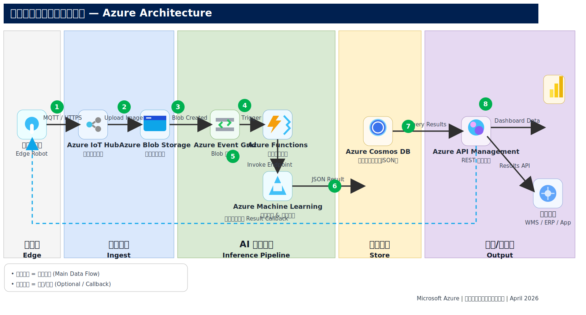

# 智能视觉检测云端解决方案 × Azure

> **Vision AI Solution on Microsoft Azure**  
> Microsoft Azure | April 2026

---

## 目录 Table of Contents

1. [项目背景 Background](#1-项目背景-background)
2. [业务场景 Business Scenario](#2-业务场景-business-scenario)
3. [整体方案架构 Solution Architecture](#3-整体方案架构-solution-architecture)
4. [核心 Azure 服务 Key Azure Services](#4-核心-azure-服务-key-azure-services)
5. [Azure Machine Learning 深度解析](#5-azure-machine-learning-深度解析)
6. [Step-by-Step 部署指南](#6-step-by-step-部署指南)
7. [安全性与最佳实践 Security & Best Practices](#7-安全性与最佳实践-security--best-practices)
8. [成本估算参考 Cost Reference](#8-成本估算参考-cost-reference)
9. [总结与下一步 Summary & Next Steps](#9-总结与下一步-summary--next-steps)
10. [参考文档 References](#10-参考文档-references)

---

## 1. 项目背景 Background

随着零售数字化进程加速，货架巡检、商品识别、陈列合规检测成为门店运营的高频需求。新一代智能巡检机器人可在门店内自动巡检货架，采集货架图像，为门店运营提供实时数据支撑。

本方案基于 **Microsoft Azure** 构建一套完整的云端 AI 视觉检测流水线，实现：

- 机器人拍摄的货架图片的安全上传与弹性存储
- 云端 AI 模型对商品的自动识别与陈列合规检测
- 推理结果的实时回传与多系统集成

---

## 2. 业务场景 Business Scenario

### 2.1 场景描述

```
巡检机器人（Edge Robot）
  │
  ├─ 摄像头自动巡检货架（高分辨率图片）
  ├─ 通过 4G / 5G / Wi-Fi 上传图片至 Azure 云端
  │
  ▼
Azure 云端 AI 推理管道
  │
  ├─ 商品识别（Product Recognition）
  ├─ 货架陈列检测（Planogram Compliance）
  ├─ 缺货/错位检测（Out-of-Stock / Misplaced Detection）
  │
  ▼
推理结果回传
  │
  ├─ 边缘设备本地显示/提示
  ├─ 门店 WMS / ERP 系统
  └─ 管理 Dashboard（Power BI）
```

### 2.2 业务挑战

| 挑战 | 描述 |
|------|------|
| **海量图片存储** | 每家门店每天产生数千张货架照片，需弹性、低成本存储方案 |
| **实时 AI 推理** | 要求推理延迟低（< 2s）、吞吐量高（并发多门店） |
| **模型持续迭代** | 商品 SKU 频繁更新，模型需随业务快速迭代 |
| **边云协同** | 机器人端与云端数据需安全、可靠地双向流通 |
| **多系统集成** | 检测结果需同步至 WMS / ERP / BI 等下游系统 |

---

## 3. 整体方案架构 Solution Architecture

### 3.1 架构图



如需编辑原始图，请使用 `Image_Recognation_Azure.drawio` 或 `Image_Recognation_Azure_v1.drawio`。

```
┌─────────────────────────────────────────────────────────────────────────────────┐
│                              Microsoft Azure                                    │
│                                                                                 │
│  ┌──────────┐   MQTT/   ┌──────────┐  Upload  ┌──────────────┐  Blob Created  │
│  │          │  HTTPS    │  Azure   │ ───────▶  │    Azure     │ ──────────────▶│
│  │  Edge    │ ────────▶ │ IoT Hub  │           │ Blob Storage │                │
│  │  Robot   │           │          │           │ (raw-images) │                │
│  └──────────┘           └──────────┘           └──────────────┘                │
│                                                         │                       │
│                                                   Event Grid                   │
│                                                         │                       │
│                                               ┌─────────▼────────┐             │
│                                               │  Azure Functions  │             │
│                                               │  (Orchestrator)  │             │
│                                               └────────┬─────────┘             │
│                                                        │                        │
│                              ┌─────────────────────────┼─────────────────────┐ │
│                              │                         │                     │ │
│                    ┌─────────▼────────┐   ┌───────────▼──────────┐          │ │
│                    │  Azure Machine   │   │   Azure AI Vision    │          │ │
│                    │    Learning      │   │  (Computer Vision /  │          │ │
│                    │ Online Endpoint  │   │   Custom Model API)  │          │ │
│                    └─────────┬────────┘   └───────────┬──────────┘          │ │
│                              │                         │                     │ │
│                              └──────────┬──────────────┘                    │ │
│                                         │                                    │ │
│                               ┌─────────▼─────────┐                         │ │
│                               │   Azure Cosmos DB  │                         │ │
│                               │  (JSON Results)    │                         │ │
│                               └─────────┬──────────┘                         │ │
│                                         │                                     │ │
│               ┌─────────────────────────┘                                     │ │
│               │                                                                │ │
│   ┌───────────▼──────────┐   ┌──────────────────────┐                        │ │
│   │  API Management      │   │      Power BI         │                        │ │
│   │  (REST Gateway)      │   │    (Dashboard)        │                        │ │
│   └───────────┬──────────┘   └──────────────────────┘                        │ │
│               │                                                                │ │
└───────────────┼────────────────────────────────────────────────────────────────┘
                │  推理结果回传
                ▼
     边缘设备 / WMS / ERP / 门店系统
```

### 3.2 数据流说明

| 步骤 | 说明 |
|------|------|
| **① 采集上传** | 巡检机器人通过 MQTT/HTTPS 连接 Azure IoT Hub，安全上传货架图片 |
| **③ 对象存储** | 图片落地到 Azure Blob Storage `raw-images` 容器 |
| **④ 事件触发** | Blob Created 事件通过 Azure Event Grid 实时推送到 Azure Functions |
| **⑤ 推理调用** | Azure Functions 下载图片，调用 AML Online Endpoint 或 Azure AI Vision API |
| **⑥ 结果存储** | 推理 JSON 结果（识别商品、置信度、坐标等）写入 Azure Cosmos DB |
| **⑦ 结果回传** | 通过 Azure API Management 的 REST 接口，结果实时推送至边缘设备及业务系统 |
| **⑦ 可视化** | Power BI 连接 Cosmos DB，呈现货架合规率、缺货率等指标 Dashboard |

---

## 4. 核心 Azure 服务 Key Azure Services

### 4.1 Azure IoT Hub

- **作用**：巡检机器人设备的安全接入入口
- **特性**：
  - 支持 MQTT / AMQP / HTTPS 协议
  - X.509 证书设备认证
  - Device Twin 管理设备状态
  - 消息路由至 Blob Storage / Event Hub
- **推荐 SKU**：Standard S1（按消息量计费）

### 4.2 Azure Blob Storage

- **作用**：弹性存储货架原始图片
- **配置建议**：
  - Container：`raw-images`（热层）、`processed-images`（冷层）
  - 生命周期策略：30天 → Cool，180天 → Archive
  - 启用版本控制与软删除（数据保护）
  - 通过 Private Endpoint 限制公网访问

### 4.3 Azure Event Grid

- **作用**：Blob 上传事件的实时推送分发（生产环境推荐）
- **特性**：
  - 近零延迟（< 1秒事件推送，避免 Blob Trigger 轮询延迟）
  - 内置重试与死信队列，不漏触发
  - 支持过滤：仅触发 `.jpg` / `.png` 文件创建事件
  - 天然支持多门店高并发场景
- **与 Blob Trigger 的区别**：见 4.4 节对比说明

### 4.4 Azure Functions

- **作用**：无服务器推理编排器
- **触发方式选择**：根据阶段选择合适的触发方式

#### 方式一：Blob Trigger 直连（PoC / 测试阶段推荐）

Functions 内置 Blob Trigger，无需单独配置 Event Grid，代码最简单：

```python
import azure.functions as func

app = func.FunctionApp()

@app.blob_trigger(
    arg_name="blob",
    path="raw-images/{name}",        # 监听此容器，有新文件即触发
    connection="AzureWebJobsStorage"
)
def process_shelf_image(blob: func.InputStream):
    image_bytes = blob.read()
    result = call_aml_endpoint(image_bytes)   # 调用 AML 推理端点
    store_to_cosmosdb(result)                 # 存储推理结果
    notify_edge_device(result)                # 回传结果
```

> ⚠️ **注意**：Blob Trigger 底层通过**轮询**检测新文件，低频时触发延迟最长可达 **10 分钟**，不适合生产环境实时推理需求。

#### 方式二：Event Grid + HTTP Trigger（生产环境推荐）

Blob Storage 有新文件时主动推送事件给 Functions，实现**毫秒级触发**：

```python
import azure.functions as func
import json

app = func.FunctionApp()

@app.route(route="process-shelf-image", methods=["POST"])
def process_shelf_image(req: func.HttpRequest) -> func.HttpResponse:
    # Event Grid 推送的事件体
    events = req.get_json()

    # Event Grid 握手验证（首次订阅时）
    if events[0].get("eventType") == "Microsoft.EventGrid.SubscriptionValidationEvent":
        code = events[0]["data"]["validationCode"]
        return func.HttpResponse(json.dumps({"validationResponse": code}),
                                 mimetype="application/json")

    # 处理 BlobCreated 事件
    for event in events:
        if event.get("eventType") == "Microsoft.Storage.BlobCreated":
            blob_url = event["data"]["url"]        # 新图片的完整 URL
            blob_name = event["subject"].split("/")[-1]

            image_bytes = download_blob(blob_url)             # 从 Blob 下载图片
            result = call_aml_endpoint(image_bytes)           # 调用 AML 推理端点
            store_to_cosmosdb(blob_name, result)              # 存储推理结果
            notify_edge_device(result)                        # 回传结果

    return func.HttpResponse("OK", status_code=200)
```

配套 Event Grid 订阅（将 Blob 事件路由到上面的 Function）：

```bash
az eventgrid event-subscription create \
  --name blob-to-function \
  --source-resource-id <storage-account-resource-id> \
  --endpoint-type webhook \
  --endpoint https://<function-app>.azurewebsites.net/api/process-shelf-image \
  --included-event-types Microsoft.Storage.BlobCreated \
  --subject-begins-with /blobServices/default/containers/raw-images
```

#### 两种方式对比

| | Blob Trigger（直连） | Event Grid + HTTP Trigger |
|---|---|---|
| **触发机制** | Functions 定时轮询 Blob Storage | Blob Storage 主动推送事件 |
| **触发延迟** | 最长 **10 分钟**（低频时） | **< 1 秒**（近实时） |
| **代码复杂度** | ⭐ 简单，开箱即用 | ⭐⭐ 需处理 Event Grid 握手 |
| **可靠性** | 高并发时可能漏触发 | 内置重试 + 死信队列，不漏事件 |
| **多门店并发** | 性能下降 | 天然水平扩展 |
| **适用阶段** | **PoC / 功能验证** | **生产环境** |

- **推荐**：Python 3.11 运行时，Consumption Plan（按调用量计费）

### 4.5 Azure Machine Learning

> 详见 [第 5 节](#5-azure-machine-learning-深度解析)

### 4.6 Azure AI Vision (Foundry Tools)

- **作用**：预构建 CV API，快速实现商品检测
- **能力**：
  - 物体检测（Object Detection）
  - OCR（价签文字识别）
  - 图像分类（Image Classification）
- **适用场景**：快速 PoC，无需自定义训练
- **替代方案**：Azure AI Foundry 上的多模态模型（GPT-4o Vision）

### 4.7 Azure Cosmos DB

- **作用**：存储每次检测的 JSON 推理结果
- **配置建议**：
  - Partition Key：`storeId`（按门店分区，高基数）
  - Serverless 模式（PoC 阶段低成本）→ Provisioned（生产）
  - TTL：90天自动过期历史结果（可选）
- **数据模型示例**：
  ```json
  {
    "id": "img-20260406-001",
    "storeId": "store-sh-001",
    "robotId": "robot-001",
    "capturedAt": "2026-04-06T10:30:00Z",
    "imageUrl": "https://storage.../raw-images/img-001.jpg",
    "detections": [
      {
        "productId": "sku-12345",
        "productName": "Coca-Cola 330ml",
        "confidence": 0.97,
        "bbox": [120, 45, 280, 190],
        "status": "in_stock"
      }
    ],
    "complianceScore": 0.92,
    "outOfStockCount": 2
  }
  ```

### 4.8 Azure API Management

- **作用**：统一 REST 网关，安全暴露推理结果接口
- **功能**：
  - OAuth 2.0 / API Key 认证
  - 请求限流与配额管理
  - 请求/响应转换
  - Developer Portal 自动生成 API 文档

---

## 5. Azure Machine Learning 深度解析

### 5.1 什么是 Azure Machine Learning

Azure Machine Learning (AML) 是微软的企业级 MLOps 平台，覆盖机器学习全生命周期：

```
数据准备 → 数据标注 → 模型训练 → 模型评估 → 模型注册 → 端点部署 → 监控 & 再训练
```

### 5.2 AML 在本项目中的核心角色

#### 5.2.1 数据标注（Data Labeling）

```bash
# AML Studio → Data Labeling → 创建 Object Detection 项目
# 支持：人工标注 / ML 辅助标注（加速 50%+）
# 输出格式：COCO JSON / Pascal VOC
```

#### 5.2.2 模型训练（Model Training）

**推荐模型**：YOLOv8（目标检测）或 AML AutoML for Images

```python
# AML AutoML 示例
from azure.ai.ml import MLClient
from azure.ai.ml.automl import image_object_detection
from azure.ai.ml.entities import ResourceConfiguration

image_object_detection_job = image_object_detection(
    compute="gpu-cluster",
    experiment_name="shelf-detection",
    training_data=MLTable_training_data,
    target_column_name="label",
    primary_metric="mean_average_precision",
)
image_object_detection_job.set_limits(timeout_minutes=120)
ml_client.jobs.create_or_update(image_object_detection_job)
```

#### 5.2.3 模型部署（Online Endpoint）

```python
from azure.ai.ml.entities import ManagedOnlineEndpoint, ManagedOnlineDeployment

# 创建在线端点
endpoint = ManagedOnlineEndpoint(
    name="shelf-detection-endpoint",
    auth_mode="key"
)
ml_client.online_endpoints.begin_create_or_update(endpoint)

# 部署模型
deployment = ManagedOnlineDeployment(
    name="blue",
    endpoint_name="shelf-detection-endpoint",
    model=registered_model,
    instance_type="Standard_NC4as_T4_v3",  # GPU VM
    instance_count=1,
)
ml_client.online_deployments.begin_create_or_update(deployment)
```

#### 5.2.4 调用推理端点

```python
import urllib.request
import json

url = "https://shelf-detection-endpoint.azureml.ms/score"
api_key = "<YOUR_API_KEY>"  # 建议用 Managed Identity 替代

data = {"image_url": "https://storage.blob.core.windows.net/raw-images/img-001.jpg"}
body = json.dumps(data).encode("utf-8")

req = urllib.request.Request(url, body, {"Content-Type": "application/json",
                                          "Authorization": f"Bearer {api_key}"})
response = urllib.request.urlopen(req)
result = json.loads(response.read())
```

#### 5.2.5 MLflow 实验追踪

```python
import mlflow

mlflow.set_experiment("shelf-detection")
with mlflow.start_run():
    mlflow.log_param("model", "yolov8n")
    mlflow.log_param("epochs", 100)
    mlflow.log_metric("mAP50", 0.89)
    mlflow.log_metric("mAP50-95", 0.72)
```

### 5.3 MLOps 流水线

```
GitHub Push
     │
     ▼
GitHub Actions CI/CD
     │
     ├─► AML Pipeline 触发训练作业
     │       ├─ 数据预处理
     │       ├─ 模型训练（GPU 集群）
     │       └─ 模型评估
     │
     ├─► 评估通过 → 注册新模型版本
     │
     └─► 蓝绿部署 → 流量 10% → 100% 切换
```

---

### 5.4 用户自有模型接入指南（Bring Your Own Model）

如果用户已有训练好的商品识别/陈列检测模型（`.pt` / `.onnx` / `.pkl`），可通过以下流程将其托管到 AML，无需重新训练。

#### 5.4.1 整体流程

```
自有模型文件 (.pt / .onnx / .pkl)
        ↓
   注册到 AML Model Registry
        ↓
   编写推理入口脚本 (score.py)
        ↓
   定义推理环境 (Environment / conda.yml)
        ↓
   部署为 Online Endpoint
        ↓
   Azure Functions 通过 REST API 调用
```

#### 5.4.2 常见模型文件格式说明

| 格式 | 框架 | 适用场景 | 跨语言部署 |
|------|------|----------|-----------|
| `.pt` | PyTorch 专用 | 训练/微调/云端推理 | ❌ |
| `.onnx` | 跨框架通用（ONNX） | **边缘推理首选**，性能提升 20–50% | ✅ |
| `.pkl` | Python Pickle | scikit-learn / XGBoost 等传统 ML | ❌ |

> **建议**：云端 AML 推理直接使用 `.pt`；边缘盒子推理建议将 `.pt` 导出为 `.onnx`，体积更小、延迟更低。

#### 5.4.3 Step 1：上传并注册模型

通过 Python SDK 将本地模型文件注册到 AML Model Registry：

```python
from azure.ai.ml import MLClient
from azure.ai.ml.entities import Model
from azure.identity import DefaultAzureCredential

ml_client = MLClient(
    DefaultAzureCredential(),
    subscription_id="<YOUR_SUBSCRIPTION_ID>",
    resource_group_name="rg-shelfvision",
    workspace_name="shelfvision-aml-workspace"
)

model = ml_client.models.create_or_update(
    Model(
        path="./weights/shelf_detection_v2.pt",  # 本地模型文件路径
        name="shelf-detection-model",
        version="2",
        description="货架陈列检测模型 YOLOv8",
        type="custom_model"
    )
)
print(f"模型已注册：{model.name}:{model.version}")
```

> 也可在 **AML Studio（ml.azure.com）→ Models → Register model → From local files** 通过 GUI 上传，无需编写代码。

#### 5.4.4 Step 2：编写推理入口脚本（score.py）

`score.py` 是告诉 AML「收到请求后如何处理」的关键文件，必须包含两个函数：

- **`init()`**：容器启动时执行一次，用于加载模型（避免每次请求都重新加载）
- **`run(raw_data)`**：每次推理请求调用，解析输入 → 推理 → 返回结果

```python
# score.py
import json, os, torch
from PIL import Image
import io, base64

model = None

def init():
    """AML 容器启动时调用（只执行一次），加载模型到内存"""
    global model
    # AZUREML_MODEL_DIR 是 AML 自动注入的环境变量，指向已注册模型的目录
    model_path = os.path.join(os.getenv("AZUREML_MODEL_DIR"), "shelf_detection_v2.pt")
    model = torch.load(model_path, map_location="cpu")
    model.eval()
    print("模型加载完成")

def run(raw_data):
    """每次推理请求时调用"""
    data = json.loads(raw_data)

    # 解码 Base64 编码的图片
    img_bytes = base64.b64decode(data["image"])
    img = Image.open(io.BytesIO(img_bytes)).convert("RGB")

    # 执行推理
    with torch.no_grad():
        results = model(img)

    detections = results.pandas().xyxy[0].to_dict(orient="records")

    return json.dumps({
        "detections": detections,
        "count": len(detections)
    })
```

> 如果伙伴的模型是 ONNX 格式，在 `init()` 中改用 `onnxruntime.InferenceSession` 加载即可，其余逻辑不变。

#### 5.4.5 Step 3：定义推理环境

在 AML 中注册推理所需的 Python 环境（依赖项），AML 会自动构建 Docker 镜像：

```python
from azure.ai.ml.entities import Environment

env = ml_client.environments.create_or_update(
    Environment(
        name="shelf-detection-env",
        conda_file="./conda.yml",
        image="mcr.microsoft.com/azureml/openmpi4.1.0-cuda11.8-cudnn8-ubuntu22.04",
        description="YOLOv8 货架检测推理环境"
    )
)
```

`conda.yml` 依赖配置示例：

```yaml
channels:
  - conda-forge
dependencies:
  - python=3.10
  - pip:
    - torch==2.0.1
    - ultralytics          # YOLOv8
    - pillow
    - azureml-inference-server-http  # AML 推理服务器（必须）
```

> 如果使用 ONNX 推理，将 `torch` 替换为 `onnxruntime-gpu`（GPU）或 `onnxruntime`（CPU）。

#### 5.4.6 Step 4：部署为 Online Endpoint

```python
from azure.ai.ml.entities import (
    ManagedOnlineEndpoint,
    ManagedOnlineDeployment,
    CodeConfiguration
)

# 1. 创建推理端点（Endpoint）
endpoint = ml_client.online_endpoints.begin_create_or_update(
    ManagedOnlineEndpoint(
        name="shelf-detection-endpoint",
        auth_mode="key"   # 使用 API Key 鉴权（生产建议改为 Managed Identity）
    )
).result()

# 2. 创建部署（绑定模型 + 环境 + 算力）
deployment = ml_client.online_deployments.begin_create_or_update(
    ManagedOnlineDeployment(
        name="blue",
        endpoint_name="shelf-detection-endpoint",
        model=model,                          # 上面注册的模型
        environment=env,                      # 上面定义的环境
        code_configuration=CodeConfiguration(
            code="./src",
            scoring_script="score.py"         # 推理入口脚本
        ),
        instance_type="Standard_NC6s_v3",    # GPU 实例（推荐）
        instance_count=1
    )
).result()

# 3. 将 100% 流量切到 blue 部署
endpoint.traffic = {"blue": 100}
ml_client.online_endpoints.begin_create_or_update(endpoint).result()
print(f"端点已就绪：{endpoint.scoring_uri}")
```

**端点部署规格参考：**

| 场景 | 推荐实例类型 | 说明 |
|------|------------|------|
| PoC / 测试 | `Standard_DS3_v2`（CPU） | 低成本验证推理逻辑 |
| 轻量 GPU 推理 | `Standard_NC4as_T4_v3` | T4 GPU，性价比高 |
| 生产高并发 | `Standard_NC6s_v3` | V100 GPU，适合多门店并发 |
| 超大批量 | Batch Endpoint | 按需触发，成本更低 |

#### 5.4.7 Step 5：Azure Functions 调用推理端点

端点部署完成后，Azure Functions 通过 REST API 调用：

```python
# function_app.py（推理调用部分）
import requests, os, base64, json

AML_ENDPOINT_URL = os.environ["AML_ENDPOINT_URL"]  # 存入 Function App 环境变量
AML_API_KEY      = os.environ["AML_API_KEY"]        # 生产环境建议改用 Managed Identity

def call_aml_endpoint(image_bytes: bytes) -> dict:
    """调用 AML 在线推理端点"""
    headers = {
        "Authorization": f"Bearer {AML_API_KEY}",
        "Content-Type": "application/json"
    }
    payload = {
        "image": base64.b64encode(image_bytes).decode("utf-8")
    }
    response = requests.post(
        AML_ENDPOINT_URL,
        json=payload,
        headers=headers,
        timeout=30
    )
    response.raise_for_status()
    return response.json()
```

> **安全建议**：生产环境将 `AML_API_KEY` 替换为 **Managed Identity**，Function 通过 `DefaultAzureCredential()` 自动获取 Token，无需在配置中存储密钥。

#### 5.4.8 GUI 操作方式（ml.azure.com）

上述所有步骤均可在 **AML Studio 图形界面**完成，无需写 SDK 代码：

| 步骤 | GUI 路径 |
|------|---------|
| 注册模型 | **Models → Register model → From local files**（上传 .pt/.onnx 文件） |
| 创建环境 | **Environments → Create**（填写 conda.yml 或选基础镜像） |
| 创建端点 | **Endpoints → Real-time endpoints → Create** |
| 绑定部署 | **Endpoint 详情页 → Add deployment**（选模型/环境/算力） |
| 切换流量 | **Endpoint → Traffic 滑块**（拖动分配各 Deployment 流量比例） |
| 测试推理 | **Endpoint → Test tab**（直接粘贴 JSON 测试，无需调用代码） |
| 查看日志 | **Deployment → Logs**（实时查看推理日志和错误信息） |

> **推荐上手路径**：先用 GUI 跑通完整流程（注册 → 部署 → Test tab 验证），确认推理结果正确后，再将流程固化为 SDK 代码接入 CI/CD。

#### 5.4.9 增量训练 / 模型微调（可选）

如果伙伴需要在 AML 上对自有模型进行增量训练或微调：

```python
from azure.ai.ml import command, Input
from azure.ai.ml.entities import Command

# 提交训练 Job
job = command(
    code="./training_src",           # 训练代码目录
    command="python train.py --data ${{inputs.dataset}} --epochs 50 --weights best.pt",
    inputs={
        "dataset": Input(
            type="uri_folder",
            path="azureml:shelf-images-v3:1"   # AML 数据集资产
        )
    },
    environment="shelf-detection-env:1",
    compute="gpu-cluster",           # 已创建的 GPU 计算集群
    experiment_name="shelf-retrain"
)
returned_job = ml_client.jobs.create_or_update(job)
print(f"训练 Job 已提交：{returned_job.studio_url}")
```

训练完成后，新模型自动保存到 AML Outputs，可直接注册为新版本并滚动更新 Endpoint。

---

## 6. Step-by-Step 部署指南

### Phase 1：基础设施准备

```bash
# 1. 创建资源组
az group create --name rg-shelfvision --location eastasia

# 2. 创建 IoT Hub
az iot hub create \
  --name shelfvision-iothub \
  --resource-group rg-shelfvision \
  --sku S1

# 3. 注册巡检设备
az iot hub device-identity create \
  --hub-name shelfvision-iothub \
  --device-id edge-robot-001

# 4. 创建 Storage Account
az storage account create \
  --name shelfvisionstorage \
  --resource-group rg-shelfvision \
  --sku Standard_LRS \
  --kind StorageV2

# 5. 创建 Blob 容器
az storage container create --name raw-images --account-name shelfvisionstorage
az storage container create --name results     --account-name shelfvisionstorage
```

### Phase 2：Azure Machine Learning 工作区搭建

```bash
# 1. 创建 AML 工作区
az ml workspace create \
  --name shelfvision-aml-workspace \
  --resource-group rg-shelfvision \
  --location eastasia

# 2. 创建 GPU 计算集群（训练用）
az ml compute create \
  --name gpu-cluster \
  --type AmlCompute \
  --min-instances 0 \
  --max-instances 4 \
  --size Standard_NC6s_v3 \
  --workspace-name shelfvision-aml-workspace \
  --resource-group rg-shelfvision

# 3. 创建在线端点（推理用）
az ml online-endpoint create \
  --name shelf-detection-endpoint \
  --workspace-name shelfvision-aml-workspace \
  --resource-group rg-shelfvision
```

### Phase 3：Event Grid 与 Azure Functions 配置

```bash
# 1. 创建 Function App
az functionapp create \
  --name shelfvision-shelf-processor \
  --resource-group rg-shelfvision \
  --storage-account shelfvisionstorage \
  --consumption-plan-location eastasia \
  --runtime python \
  --runtime-version 3.11 \
  --functions-version 4

# 2. 创建 Event Grid 订阅（Blob → Function）
az eventgrid event-subscription create \
  --name blob-to-function \
  --source-resource-id <storage-account-resource-id> \
  --endpoint-type azurefunction \
  --endpoint <function-resource-id> \
  --included-event-types Microsoft.Storage.BlobCreated \
  --subject-begins-with /blobServices/default/containers/raw-images
```

### Phase 4：Azure Cosmos DB 配置

```bash
# 1. 创建 Cosmos DB 账户
az cosmosdb create \
  --name shelfvision-cosmosdb \
  --resource-group rg-shelfvision \
  --kind GlobalDocumentDB \
  --capabilities EnableServerless

# 2. 创建数据库与容器
az cosmosdb sql database create \
  --account-name shelfvision-cosmosdb \
  --name ShelfVisionDB \
  --resource-group rg-shelfvision

az cosmosdb sql container create \
  --account-name shelfvision-cosmosdb \
  --database-name ShelfVisionDB \
  --name DetectionResults \
  --partition-key-path "/storeId" \
  --resource-group rg-shelfvision
```

### Phase 5：Azure Functions 核心代码

```python
# function_app.py
import azure.functions as func
import logging
import json
import requests
from azure.identity import DefaultAzureCredential
from azure.cosmos import CosmosClient

app = func.FunctionApp()

@app.blob_trigger(
    arg_name="blob",
    path="raw-images/{name}",
    connection="AzureWebJobsStorage"
)
def process_shelf_image(blob: func.InputStream):
    logging.info(f"Processing shelf image: {blob.name}")

    # 1. 调用 AML 推理端点
    endpoint_url = "<AML_ENDPOINT_URL>/score"
    credential = DefaultAzureCredential()
    token = credential.get_token("https://ml.azure.com/.default").token

    payload = {"image_bytes": blob.read().hex()}
    response = requests.post(
        endpoint_url,
        json=payload,
        headers={"Authorization": f"Bearer {token}",
                 "Content-Type": "application/json"},
        timeout=30
    )
    result = response.json()

    # 2. 存储到 Cosmos DB
    cosmos_client = CosmosClient(
        url="<COSMOS_ENDPOINT>",
        credential=DefaultAzureCredential()
    )
    container = cosmos_client \
        .get_database_client("ShelfVisionDB") \
        .get_container_client("DetectionResults")
    container.upsert_item({
        "id": blob.name,
        "storeId": result.get("store_id", "unknown"),
        "detections": result.get("detections", []),
        "complianceScore": result.get("compliance_score", 0),
    })
    logging.info("✅ Result stored to Cosmos DB")
```

### Phase 6：Power BI Dashboard

1. 在 Power BI Desktop 中选择 **Azure Cosmos DB** 数据源
2. 输入 Cosmos DB URI 和主键（或使用 Service Principal）
3. 连接 `ShelfVisionDB` → `DetectionResults`
4. 创建以下核心指标可视化：
   - **货架合规率** (`compliance_score` 平均值，按门店/时间）
   - **缺货商品排行**（`out_of_stock_count` Top N）
   - **检测量趋势**（按小时/天的检测调用次数）
5. 发布到 Power BI Service，配置自动刷新（每 15 分钟）

---

## 7. 安全性与最佳实践 Security & Best Practices

### 7.1 身份与访问控制

| 场景 | 推荐方案 |
|------|----------|
| 边缘设备 → IoT Hub | X.509 证书认证（比 SAS Token 更安全） |
| Function → AML Endpoint | Managed Identity（无需硬编码 API Key） |
| Function → Cosmos DB | Managed Identity + RBAC（Cosmos DB Built-in Data Contributor 角色） |
| 外部系统 → API Management | OAuth 2.0 客户端凭据流 |
| 开发者 → AML Workspace | Azure AD 账户 + RBAC（AzureML Data Scientist 角色） |

### 7.2 网络安全

```bash
# 为 AML Workspace 配置 Private Endpoint
az network private-endpoint create \
  --name aml-private-endpoint \
  --resource-group rg-shelfvision \
  --vnet-name shelfvision-vnet \
  --subnet aml-subnet \
  --private-connection-resource-id <aml-workspace-resource-id> \
  --group-id amlworkspace \
  --connection-name aml-connection
```

### 7.3 数据安全

- **传输加密**：所有 HTTPS/MQTT TLS 1.2+ 强制加密
- **静态加密**：Blob Storage 和 Cosmos DB 均使用 AES-256 透明加密
- **密钥管理**：敏感配置通过 **Azure Key Vault** 存储，Function 通过 Key Vault 引用访问

### 7.4 MLOps 最佳实践

- **模型版本化**：每次训练自动注册，保留全部历史版本
- **蓝绿部署**：先将 10% 流量切至新模型，验证通过后全量切换
- **数据漂移监控**：AML 内置 Dataset Monitor，自动检测生产数据与训练数据分布偏差
- **Responsible AI**：使用 AML RAI Dashboard 进行模型可解释性和公平性分析

---

## 8. 成本估算参考 Cost Reference

> 以下为 **PoC 阶段**（1个门店，每天约 500 张图片）的估算，生产环境按实际规模调整。

| 服务 | 规格 | 月费用估算（USD） |
|------|------|------------------|
| Azure IoT Hub | S1 标准，50万消息/天 | ~$25 |
| Azure Blob Storage | 热层 100 GB + 10万次操作 | ~$5 |
| Azure Event Grid | 50万事件 | ~$0.5 |
| Azure Functions | 消费计划，50万次调用 | ~$0.1 |
| Azure Machine Learning | NC6s_v3 训练（按需），端点 1 实例 | ~$200–400 |
| Azure Cosmos DB | Serverless，100万 RU | ~$0.25 |
| API Management | Developer 层（PoC） | ~$50 |
| **合计** | | **~$280–480/月** |

---

## 9. 总结与下一步 Summary & Next Steps

### 9.1 方案价值总结

| 维度 | 价值 |
|------|------|
| **弹性扩展** | Serverless + AML 自动伸缩，从 1 家到 10,000 家门店线性扩展 |
| **全托管 MLOps** | 数据标注、训练、部署、监控一体化，降低 AI 运维门槛 |
| **事件驱动** | 零轮询、近实时推理，减少不必要计算开销 |
| **企业安全** | Managed Identity / RBAC / Private Endpoint / 端到端加密 |
| **多系统集成** | API Management 标准化对接边缘设备 / WMS / ERP |

### 9.2 建议里程碑

| 阶段 | 时间 | 目标 |
|------|------|------|
| **PoC 搭建** | Week 1–2 | 基础设施部署，Azure AI Vision 快速验证 |
| **数据采集与标注** | Week 3–5 | 采集 1,000+ 张货架图片，完成 BBox 标注 |
| **首个定制模型上线** | Week 6–9 | YOLOv8 / AutoML 模型训练，mAP > 80% |
| **边缘设备集成** | Week 10–12 | 端到端联调，推理结果回传边缘设备 |
| **生产上线** | Week 13–16 | 多门店部署，Power BI Dashboard 上线 |

---

## 10. 参考文档 References

| 文档 | 链接 |
|------|------|
| Azure Architecture – Image Classification | https://learn.microsoft.com/azure/architecture/ai-ml/idea/intelligent-apps-image-processing |
| Azure Architecture – Video CV with AML | https://learn.microsoft.com/azure/architecture/ai-ml/architecture/analyze-video-computer-vision-machine-learning |
| Azure Machine Learning 文档 | https://learn.microsoft.com/azure/machine-learning/ |
| AML AutoML for Images | https://learn.microsoft.com/azure/machine-learning/concept-automated-ml |
| Azure AI Vision | https://learn.microsoft.com/azure/ai-services/computer-vision/overview |
| Azure IoT Hub 开发者指南 | https://learn.microsoft.com/azure/iot-hub/iot-hub-devguide |
| Azure Cosmos DB 最佳实践 | https://learn.microsoft.com/azure/cosmos-db/nosql/best-practice-dotnet |
| Azure Functions Python 开发 | https://learn.microsoft.com/azure/azure-functions/functions-reference-python |
| AML Managed Online Endpoint | https://learn.microsoft.com/azure/machine-learning/concept-endpoints-online |

---

## 文件清单 Repository Structure

```
Image_Recognation_Azure/
├── README.md                     ← 本文档（GitHub 说明文件）
└── Image_Recognation_Azure.pptx  ← 方案介绍 PPT
```

---

*本文档由 GitHub Copilot 辅助生成 | Microsoft Azure | April 2026*
